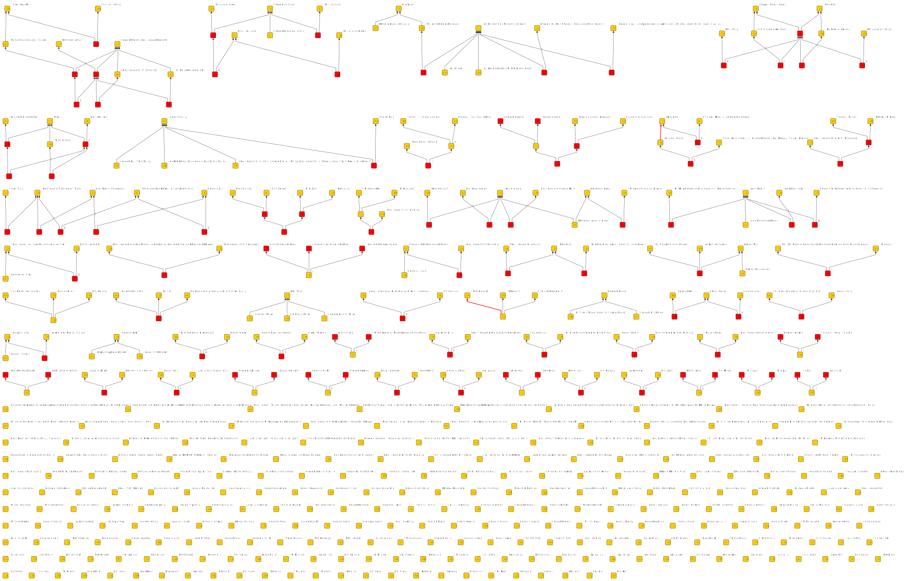

# Entity Disambiguation

Disambiguating mentions of people in a WW1 chronology.

## Input

* From [Principal Events 1914-1918](https://tigersmuseum.github.io/history/events/ww1/events-1914-15.xhtml), I construct a list of person names from the contents of HTML *span* elements with *@class="person"*. I include the value of any *@content* attributes specified on these elements. The result is **[names.txt](work/names.txt)**.

## Method

The general approach is to derive a set of tokens from the names in the list, and make an object for each token that has names that produced it as its attributes.
The results are submitted to formal concept analysis (FCA). Names are thereby associated via common tokens.

I interpret the lattice produced by FCA as containing concepts that represent people. I can hypothesize that a set of concepts represents a person and the
intent of those concept are the various names of that person. I express these hypotheses as a new context where the objects are individual people and the attributes are names.
 
I can make choices at two points in this process: Firstly, there are various ways to tokenize a name, and different methods may produce different results.
Secondly, I make some assumptions about how lattice concepts map to people. Instead of trying to find some 'best' choice, I can posit multiple agents that make different choices, and then compare the hypotheses they produce.

Here, I create 3 different agents:

* **normal** - Splits names into word tokens and removes [stopwords](work/stop.txt).
* **soundex** - Translates normal tokens to [Soundex](https://en.wikipedia.org/wiki/Soundex) codes.
* **metaphone** - Translates normal tokens to [Metaphone](https://en.wikipedia.org/wiki/Metaphone) codes.

They all apply the same assumptions in generating hypotheses:

1. *Top concepts are people* - Names with more tokens are more likely to represent an individual. The name attributes that appear at the "top" of the lattice are
assumed to relate to an individual person.
2. *Names below are the same person* - Any name formed from a subset of these tokens is an attribute on the path "down" from the top concept.
These are assumed to be names of the same person.

These assumptions are not correct in every case, but do produce some useful results that can be developed further. In general, the **normal** agent is less likely to put together two names that belong to different people, but will falsely separate names with slight variations in spelling. The two phonetic agents cope better with variations in spelling, at the cost of sometimes putting the names of two different people together. The **soundex** and *metaphone** agents may or may not agree. Both make mistakes. 

The hypotheses the three agents generate are [normal.xml](results/hypothesis/normal.xml), [soundex.xml](results/hypothesis/soundex.xml) and [metaphone.xml](results/hypothesis/metaphone.xml).

I form the disjoint union of the agent hypotheses and apply FCA. The result is [multiagent.xml](results/hypothesis/multiagent.xml), which is visualized as [multiagent.graphml](results/multiagent.graphml). Where all the agents agree, I get discrete concepts in the generated lattice.
Where agents disagree, there will be some ordering of concepts that represent conflicting hypotheses. I can inspect the visualization and use my judgement to edit the GraphML lattice:

Here, I've coloured a concept node red where it corresponds to an object that represent an incorrect hypothesis, and an edge red where attributes are incorrectly associated with an object. I can apply 

## Expert Opinion

I can represent "truth" in the same way; as a notional expert agent that asserts "facts".
I can merge these with hypotheses generated by agents, and use them to influence the assessment of those hypotheses. Some experimentation needed here.

## Issues

An issue with the agents described above is that none of the agents equate initials with forenames, which means that, for example, *Sir William Robinson* is never equivalent to *Sir W Robinson*.
This could be fixed by using a different name tokenization method, or it could be addressed by asserting the equivalence as "truth".
