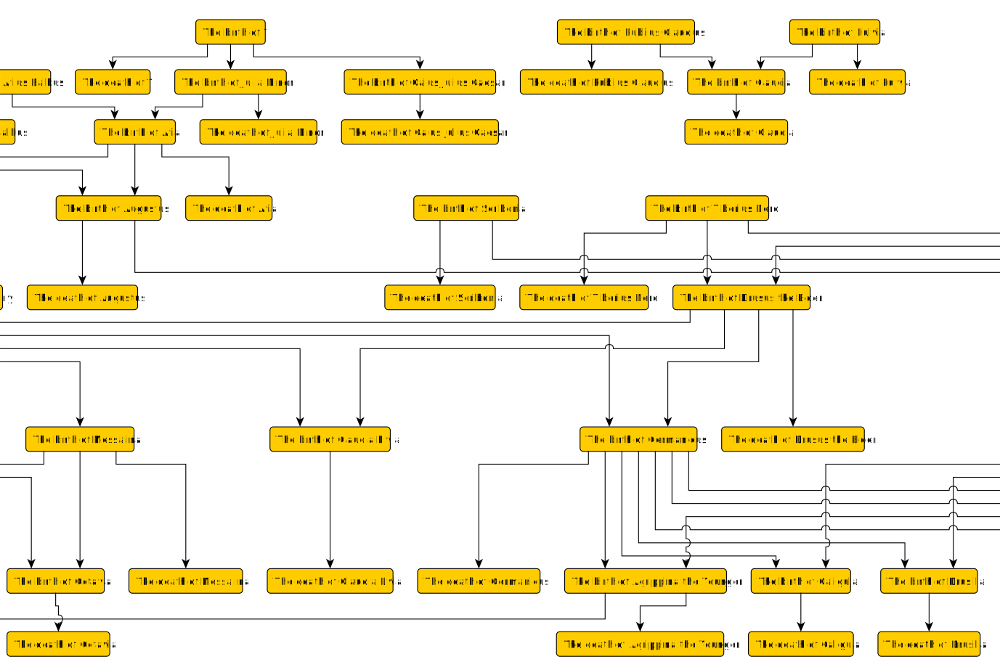
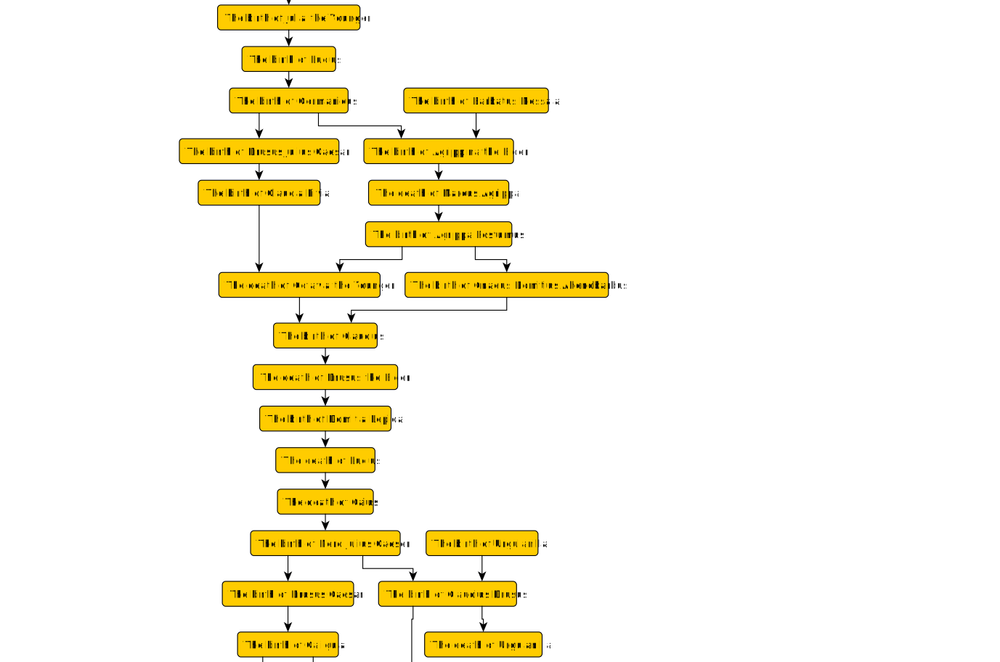

# Chronology

From [chronology.xhtml](chronology.xhtml) I can generate [events.graphml](events.graphml). The earliest events look like this ...

This is a preorder of instances and intervals as described [here](../chronology.md).

## How it works

A chronology lists events ordered in time, usually grouped by time period rather than explicitly sequenced. The structure of the chronology can be used to construct a preorder, as this [worked example](https://knoxa.github.io/examples/chronology/example.xhtml) describes.

The steps to get from the XHTML to the GraphML diagram are:

1\. Transform [chronology.xhtml](chronology.xhtml) to _event XML_ with [chronology.xsl](../../xsl/chronology.xsl).

2\. Apply [sort.xsl](../../xsl/chronology/sort.xsl) to sort the event XML in time-order.

3\. Apply [time-graphml.xsl](../../xsl/chronology/time-graphml.xsl) to make GraphML.

4\. Filter out edges that aren't covering relations with [covers.xsl](../../xsl/graphml/covers.xsl).

## Events from intervals

Some event order can be be inferred. For example, people are born before they die, and they are born after any of their ancestors and before any of their descendants. I can consider each node in the [Julio-Claudian family tree](family.md) as an interval, and infer a birth and death event for each, then order these events accordingly. Here's part of the [result](life-events1.graphml):

All these events are instants, so should be capable of being formed into a single chain. The fact that they aren't a chain indicates missing knowledge. For example, sibling are all born within the life span of their parents, so aren't comparable with each other in this construction. If I can discover the order in which they're born, I can add extra links to this diagram that make them comparable, and the overall diagram a bit more 'chain-like'.

Each pair of incomparable events in this diagram suggests a question to ask. For example,

	Was the birth of Drusus the Elder before or after the death of Augustus?
	
And the answer (in this case "before") adds a new link. I've spent some time answering such questions using Wikipedia; and periodically filtering redundant edges (using [covers.xsl](../../xsl/graphml/covers.xsl)) to assess progress and decide what questions to ask next. The result is [life-events2.graphml](life-events2.graphml). This is part of it:

This is much better, but not perfect. For example, Wikipedia says that Drusus Julius Caesar was born in the same year as Agrippina the Elder, but doesn't say more than that. Their births remain incomparable unless or until we can get more precise information from another source.

Such knowledge isn't likely ever to be perfect though, and the advantage of this preorder is that it gives some sense of how much is known and where the gaps in knowledge are. Note that this preorder is of event instances, not life events per se. I can add in other events if I like...

## Intervals from events

Having ordered birth and death events, I can, if I like, recover lifespans as intervals and make an [interval graph](https://en.wikipedia.org/wiki/Interval_graph). This could, for example, be used to check if relationships between pairs of people are plausible.
